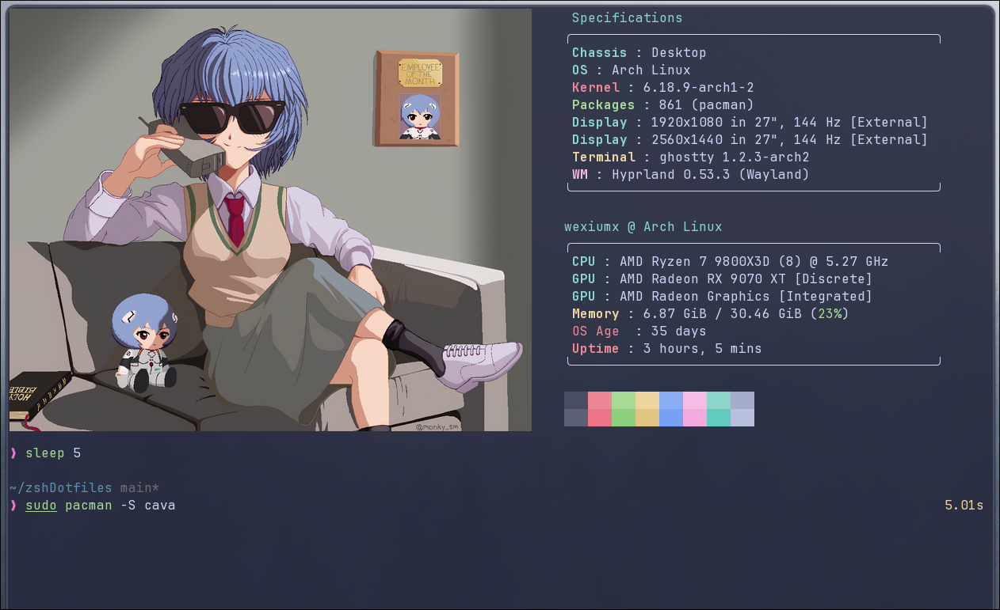
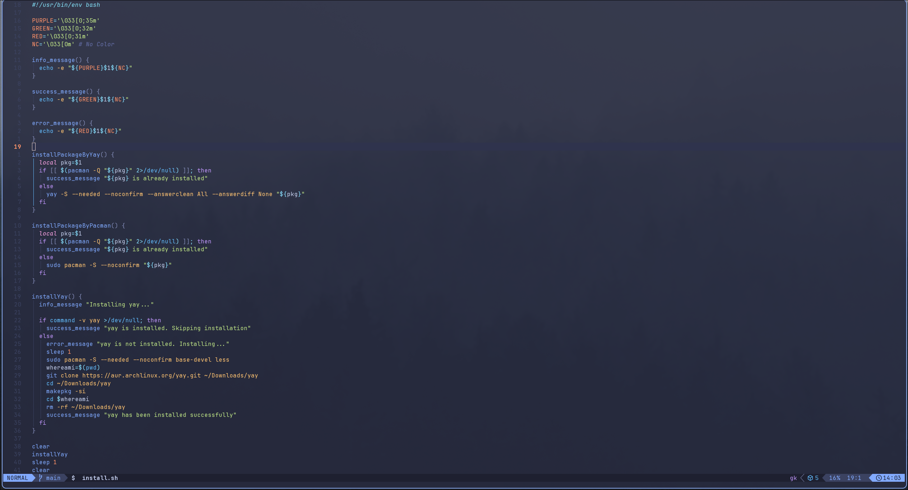

## Overview

A minimal, keyboard-driven terminal setup built around **Ghostty** and the **Catppuccin** color theme. Everything is tuned for speed and aesthetics.

This repository contains my personal terminal setup, featuring:

- **Ghostty** - Terminal
- **Zsh** - Shell
  - **Oh My Posh** - Prompt
  - **Zinit** - Plugin manager
  - **Fzf** - Fuzzy finder
  - **Zoxide** - Smart cd command
- **Nvim** - text editor
- **Tools**
  - **Eza** - modern ls
  - **Fd** - modern find
  - **Ripgrep** - modern grep
  - **Bat** - modern cat
  - **Navi** - cheat sheat for commands
  - **Lazygit** - git but more interactive
  - **Yazi** - terminal folder manager
  - **Btop** - program that shows processes


## Screenshots

<details>

  
  

</details>


## Installation

To install this terminal configuration:

> [!IMPORTANT]
> I assume that you already have the `git` package installed. If not, what are you waiting for?

```bash
cd 
git clone https://github.com/wexiumx/terminal.git 
cd terminal
./install.sh
```

> [!WARNING]
> My script may not have applied zsh to your terminal, If that happens, run this command in your terminal `sudo chsh -s /bin/zsh`

The installation script will automatically set up all configurations and symlinks.

