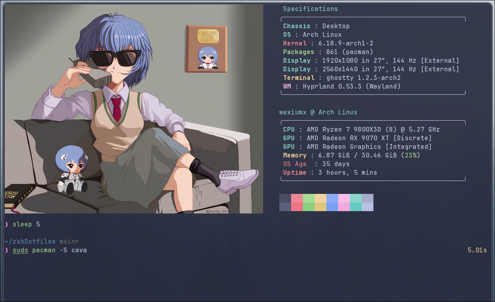

# My terminal configuration

A minimal and efficient terminal configuration for Arch Linux and Arch-based distributions.

## Screenshots

<details>

<summary>Click to view how my terminal looks</summary>

  
  

</details>


## Overview

This repository contains my personal terminal setup, featuring:

- **Ghostty** - Terminal
- **Zsh** - Shell
  - **Oh My Posh** - Prompt
  - **Zinit** - Plugin manager
  - **fzf** - Fuzzy finder
  - **Zoxide** - Smart cd command
- **Nvim** - text editor


## Installation

To install this terminal configuration:

> [!IMPORTANT]
> I assume that you already have the `git` package installed. If not, what are you waiting for?

```bash
cd 
git clone https://github.com/wexiumx/myTerminal.git 
cd myTerminal
./install.sh
```

> [!WARNING]
> My script may not have applied zsh to your terminal, If that happens, run this command in your terminal `sudo chsh -s /bin/zsh`

The installation script will automatically set up all configurations and symlinks.

## Post-Installation

To apply your new terminal, you will need to reboot to apply the changes.
